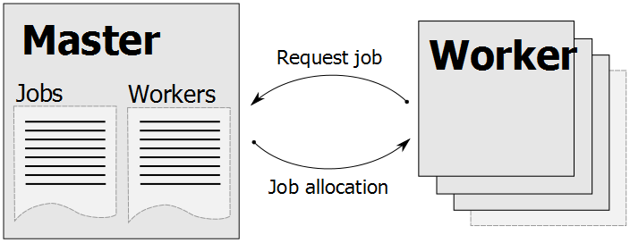
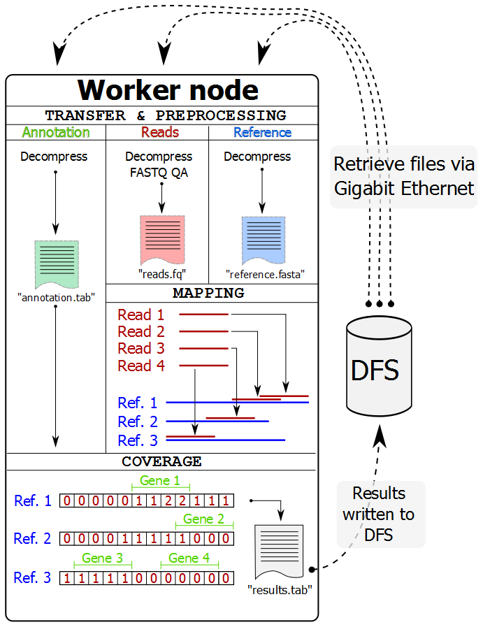

############
Introduction
############

Overview
********
The Tentacle framework is developed to enable researchers to leverage
high-performance computer (HPC) systems to quantify genes in large metagenomic
data sets.

Tentacle provides a way to distribute resource intensive mapping tasks, such
as mapping large numbers of metagenomic samples to a reference, in order to 
reduce the time required to analyze large data sets. Tentacle makes it possible
to define what mapper and mapping critera to use, and computes the coverage of
all annotated areas of the reference sequence(s).

   Tentacle uses a master-worker scheme that has Master process that maintains
   a list of mapping jobs that should be run. The Worker processes (normally
   running on computer nodes in a cluster) connects to the Master process and
   asks for a mapping job to run. 

   The Worker processes (normally on a separate computer node in a cluster)
   perform all their work without interaction with the Master process. They
   retrieve the files via network from a distributed file system (DFS), perform
   preprocessing, mapping, and coverage calculations and then write the results
   back to the distributed file system. After completing a job, the Worker
   process requests a new one from the Master process.

Use examples
************
Tentacle is well suited for the following tasks:

 * Map samples of metagenomic reads back to previously annotated contigs
   to determine the presence and abundance of certain genes.
 * Map metagenomic reads to a reference database of e.g. antibiotic 
   resistance genes. 

Abstract
********
Metagenomics is the study of microorganisms by sequencing of random DNA
fragments from microbial communities. Since no cultivation of individual
organisms is required, metagenomics can be used to analyze the large proportion
of microorganisms that are hard or impossible to grow in laboratories.
Metagenomics therefore holds great promise for understanding complex microbial
communities and their interactions with their respective environments. The
analysis of metagenomes in human gut, oral cavities and on our skin can, for
example, provide information about what microorganisms are present and their
effects on human health.  The introduction of high-throughput DNA sequencing
has significantly increased the size of the metagenomes which today can contain
trillions of nucleotides (terabases) from one single sample. Current methods
are however not designed with these large amounts of data in mind and are
consequently forced to significantly reduce the sensitivity to achieve
acceptable computational times. 
We have therefore developed a new method for distributed gene quantification in
metagenomes. In contrast to many existing methods that are designed for
single-computer systems our methods can be run on computer clusters and grids.
Through efficient data dissemination and state-of-the-art sequence alignment
algorithms the framework can rapidly and accurately estimate the gene abundance
in very large metagenomes while still maintaining a high sensitivity. The
output of our framework is adapted for further statistical analysis, for
example comparative metagenomics to identify both quantitative and qualitative
differences between metagenomes.  Our method is shown to scale well with the
number of available compute nodes and provides a flexible way to optimally
utilize the available compute resources. It provides fast and sensitive
analysis of terabase size metagenomes and thus enables analysis of studies of
microbial communities at a resolution and sensitivity previously not feasible.

Copyright and license
*********************
Tentacle was developed at Chalmers University of Technology and is Copyright
Fredrik Boulund, Anders Sjögren, and Erik Kristiansson. The code is freely
available for use, re-use, and modification under the GPL (see :ref:`citing`).
