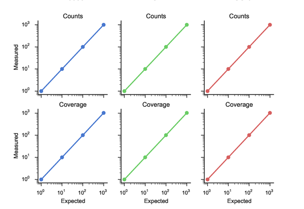
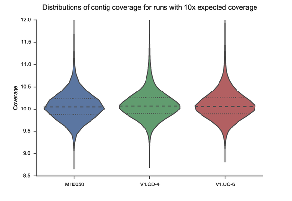

.. _Performance:

Performance evaluation
^^^^^^^^^^^^^^^^^^^^^^

The performance of Tentacle has been evaluated on its scaling characteristics
when running in a distributed enviroment, as well as the quantification
accuracy of the abundance estimation features. All evaluations and tests are
described in the article (see :ref:`citing`).

Scaling performance
*******************
Tentacle scales very well with increasing computing resources. The following
figure shows how the throughput of Tentacle scales when increasing the number
of utilized worker nodes. For complete test details, refer to :ref:`citing`.
The evaluation results data and code to generate the figures are available for
download from `figshare`__. A non-interactive version of the IPython notebook can
be `viewed in your browser`__.

.. _figsharescaling: http://figshare.com/articles/Tentacle_scaling_benchmark/1403608
__ figsharescaling_
.. _scalingnb: http://nbviewer.ipython.org/url/bioinformatics.math.chalmers.se/tentacle/Tentacle%20scaling%20benchmark.ipynb
__ scalingnb_

.. figure:: ./img/scaling.png
   :align: center
   :alt: Tentacle scaling

   Tentacle scales very well with increasing number of computer nodes.

Quantification accuray
**********************
The accuracy of quantification and coverage was also estimated. The following
two figures show the expected and measured coverage and quantification results.
For complete test details, please refer to :ref:`citing` and the IPython
notebook which contains the code to generate the figures. The evaluation
results data and code to generate the figures are available for download from
`figshare`__. 
A non-interactive version of the IPython notebook can be `viewed in your browser`__.

.. _figsharequantification: http://figshare.com/articles/Tentacle_quantification_accuracy_evaluation/1403609
__ figsharequantification_
.. _quantificationnb: http://nbviewer.ipython.org/url/bioinformatics.math.chalmers.se/tentacle/Tentacle%20coverage%20evaluation.ipynb
__ quantificationnb_

   
   Tentacle achieves very good coverage and quantification accuracy.

   The distribution of the measured quantification levels follows the expected
   values for this synthetic test case.
