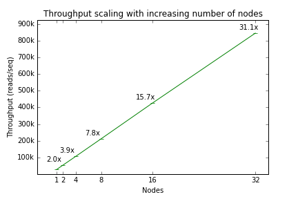

Tentacle performance
********************
The performance of Tentacle has been evaluated on its scaling characteristics
when running in a distributed enviroment, as well as the quantification
accuracy of the abundance estimation features. All evaluations and tests
are described in the article (see :ref:`citing`).

.. _Scaling performance:

Scaling performance
===================
Tentacle scales very well with increasing computing resources. The following
figure shows how the throughput of Tentacle scales when increasing the number
of utilized worker nodes. For complete test details, refer to :ref:`citing`. 
The evaluation results data and code to generate the figures are available for
download from `figshare
<http://figshare.com/articles/Tentacle_scaling_benchmark/1403608>`_. A
non-interactive version of the IPython notebook can also be `viewed in your
browser
<http://nbviewer.ipython.org/url/bioinformatics.math.chalmers.se/tentacle/Tentacle%20scaling%20benchmark.ipynb>`_.

   Tentacle scales well with increasing number of nodes.

.. _Quantification accuracy:

Quantification accuracy
=======================
The accuracy of quantification and coverage was also estimated. The following
two figures show the expected and measured coverage and quantification results.
For complete test details, please refer to :ref:`citing` and the IPython
notebook which contains the code to generate the figures. The evaluation
results data and code to generate the figures are available for download from
`figshare
<http://figshare.com/articles/Tentacle_quantification_accuracy_evaluation/1403609>`_.
A non-interactive version of the IPython notebook can also be `viewed in your
browser
<http://nbviewer.ipython.org/url/bioinformatics.math.chalmers.se/tentacle/Tentacle%20coverage%20evaluation.ipynb>`_.

Unforatunately, Sphinx does not allow embedding PDF imagery, so the following
figures are only available as links to PDF figures.

.. figure:: ./img/increases.pdf
   :scale: 50%
   :alt: Coverage and quantification accuracy

   Tentacle achieves very good coverage and quantification accuracy.

.. figure:: ./img/violins.pdf
   :scale: 50%
   :alt: Distribution of measured quantification results on a semi-synthetic test case.
   
   The distribution of the measured quantification levels.
